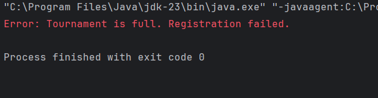
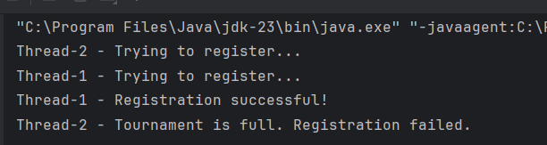

# OLA3-db - Mandatory Assignment 3

### Timothy Busk Mortensen - cph-tm246@cphbusiness.dk

---

# Optimistic & Pessimistic Concurrency Control

## Before we started 
- I created a DB. I ran the script to create the tables.
- I created a dummy tournament.
- I created a simple java application.
- I tried using thread to see if i could observe the different control types. This was just for my own enjoyment and is not a substitute the real performance report. Each function in the code is marked using the assignment numbering.  

## 1. Implement Optimistic Concurrency Control for Tournament Updates
Task:
- `Add a version column to Tournaments.`
- `Implement version-based optimistic concurrency control.`
- `Ensure that only one change is successful when two concurrent admins try to update.`

### Problem: Two admins attempt to change the start date for the same tournament at the same time.

Uden concurrency kontrol vil begge transaktioner, fra de to admins, blive accepteret. Data rækken bliver opdateret, for derefter at blive overskrevet med en ny opdatering. Begge admins tror de har opdateret og alt er fint. Men den ene admins transaction er overskrevet uden adminens kendskab til dette. 
Version baseret Optimistisk samtidigheds kontrol virker ved, at kun at acceptere den første transaction og afvise den anden, i dette tilfælde ved at benytte ´version´ som en kontrol mekanisme.

- ALTER TABLE Tournaments ADD COLUMN version INT NOT NULL DEFAULT 1;

- Jeg har benyttet samme fremgangmåde som den vedlagte note: [Optimistic Concurrency Control](https://github.com/Tine-m/final-assignment/blob/main/application-concurrency-note.md#how-optimistic-concurrency-control-works).
---

## 2. Implement Pessimistic Concurrency Control for Match Updates
Task:
- `Implement pessimistic locking using SELECT ... FOR UPDATE.`
- `Ensure only one admin can update match results at a time.`
###  Problem: Two admins attempt to update the same match result at the same time. Ensure only one update happens at a time.

- Pessimistic locking: Prevent other users from performing operations on data tables or rows until the transaction is completed.
- We are using an exclusive; We establish the exclusive lock by adding FOR UPDATE at the end of the select query.

- The transactions in the first thread locks the record and holds it until transaction commit or roll back. Any other transactions must wait before they can modify the locked record or gain access to the lock. This means admin 2 must wait until the first transaction is over before trying to modify the same record. Used the same appoach as in the note: [Optimistic Concurrency Control](https://github.com/Tine-m/final-assignment/blob/main/application-concurrency-note.md#how-optimistic-concurrency-control-works)

The second thread tries to place a lock on the record, but since the lock is held by the first thread mySQL blocks it and forces the transaction to wait. 
---

## 3. Handle Transactions for Tournament Registrations
Task:
- `If registration is successful, insert a record into Tournament_Registrations and update player ranking.`
- `If the tournament is full, rollback the transaction.`
### Problem: Ensure atomicity when registering a player in a tournament. If any part of the transaction fails, rollback all changes.

- Since our database does not enforce a maximum player limit through constraints or triggers, we check if a tournament has available slots before registering a player.
- If any part of the transaction(`checking`, `inserting`, `updating`) goes wrong, we rollback to undo all changes. 
 
---

## 4. Implement a Stored Procedure for Safe Ranking Updates
Task:
- `Create a stored procedure that updates player ranking.`
- `Use pessimistic locking to prevent simultaneous updates.`
### Problem: A player’s ranking should increase after winning a match. Ensure concurrent updates do not cause inconsistencies.

- I used the approach suggested in the assignment. -> Pessimistic locking on the stored procedure 
- This works the same way as in previous task, but the locking is being handled by the stored procedure. The record is locked until the first transaction is done or calls `rollback()`. Any other transactions trying to modify or aquire the lock, must wait.
---

## 5. Implement Concurrency Control of Your Own Choice for Tournament Registration
Task:
- `Ensure that only one registration is successful when two concurrent users try to register.`
### Problem: Two players attempt to register for the same tournament at the same time. If the max_players limit is reached, one should be rejected.

- Pessimistic Locking on tournament record.
- The second transaction is blocked and must wait until the first transaction has finished or has called the rollback(). 
- After the transaction has finished, the second thread fails because the max limit of the tournament is reached.
 
--