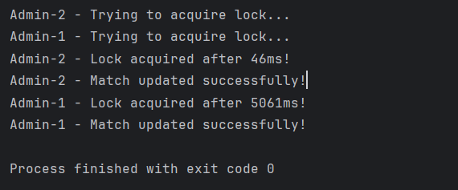

# OLA3-db - Mandatory Assignment 3

### Timothy Busk Mortensen - cph-tm246@cphbusiness.dk

---

# Optimistic & Pessimistic Concurrency Control

## Before we started 
- I created a DB. I ran the script to create the tables.
- I created a dummy tournament.
- I created a simple java application.

## 1. Implement Optimistic Concurrency Control for Tournament Updates
Task:
- `Add a version column to Tournaments.`
- `Implement version-based optimistic concurrency control.`
- `Ensure that only one change is successful when two concurrent admins try to update.`

### Problem: Two admins attempt to change the start date for the same tournament at the same time.

Uden concurrency kontrol vil begge transaktioner, fra de to admins, blive accepteret. Data rækken bliver opdateret, for derefter at blive overskrevet med en ny opdatering. Begge admins tror de har opdateret og alt er fint. Men den ene admins transaction er overskrevet uden adminens kendskab til dette. 
Version baseret Optimistisk samtidigheds kontrol virker ved, at kun at acceptere den første transaction og afvise den anden, i dette tilfælde ved at benytte ´version´ som en kontrol mekanisme.

- ALTER TABLE Tournaments ADD COLUMN version INT NOT NULL DEFAULT 1;

- Jeg har benyttet samme fremgangmåde som den vedlagte note: [Optimistic Concurrency Control](https://github.com/Tine-m/final-assignment/blob/main/application-concurrency-note.md#how-optimistic-concurrency-control-works). For at vise concurrency problematikken har jeg valgt at oprette 2 tråde. Dette skal simulere 2 admins, som begge forsøger at updatere den samme turnering på samme tid. Derfor er der også en lille indlagt pause `sleep(2000)` for at sikre at begge tråde har læst dataet inden opdatering finder sted.

- Kun den ene tråd blev accepteret. Den anden blev, som forvented, afvist. 
 

---

## 2. Implement Pessimistic Concurrency Control for Match Updates
###  Problem: Two admins attempt to update the same match result at the same time. Ensure only one update happens at a time.

- Pessimistic locking: Prevent other users from performing operations on data tables or rows until the transaction is completed.
- We are using an exclusive; We establish the exclusive lock by adding FOR UPDATE at the end of the select query.

- The transactions in the first thread locks the record and holds it until transaction commit or roll back. Any other transactions must wait before they can modify the locked record or gain access to the lock. This means admin 2 must wait until the first transaction is over before trying to modify the same record. Used the same appoach as in the note: [Optimistic Concurrency Control](https://github.com/Tine-m/final-assignment/blob/main/application-concurrency-note.md#how-optimistic-concurrency-control-works)

 
